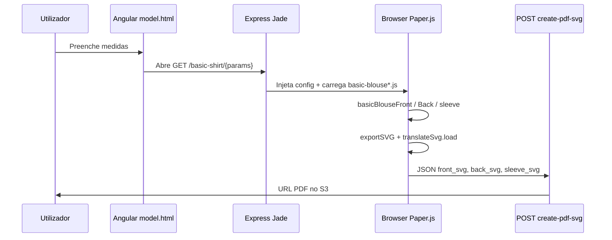

# Visão geral e fluxos de modelagem

## O que existe no projeto

Existe uma **feature de modelagem paramétrica 2D** para peças de vestuário. Não é CAD genérico: é um conjunto de **receitas de construção** (retângulos guia + regra dos sétimos do busto + curvas Bézier) codificadas em JavaScript, executadas no **browser** com Paper.js, com opção de **exportar PDF** via backend Express + PDFKit.

Há **três caminhos de entrada** distintos:

1. **Laboratório (principal para moldes)** — URL no backend Express com medidas na path → página Jade → objeto global `config` → scripts em `backend/public/javascripts/modules/`.
2. **SPA AngularJS** — formulário em `views/model.html` → `window.open` para URL do laboratório (host legado `dev.simstim.com.br`).
3. **Cópia espelhada na raiz** — `core/basic-blouse.js` (mesma lógica da blusa, usável se servido em `/core/`; fluxo ativo de PDF em `$(function(){...})` no fim do ficheiro).

## Diagrama do fluxo principal (blusa/camisa com manga)

## Peças e estado de implementação

| Peça | Módulo JS | Rotas GET (montadas) | Peças desenhadas | PDF |
|------|-----------|----------------------|------------------|-----|
| Blusa básica (completa) | `basic-blouse` | `/basic_blouse/...`, `/h/...` | Frente, costas, manga | `POST /create-pdf-svg/` (via `core` ou AJAX comentado no lab) |
| Blusa básica (só 3 medidas) | `basic-blouse-2` | `/:width/:heigth/:c_width` | Frente, costas (sem manga no arranque) | Parcial |
| Camisa (fluxo produto) | `basic-blouse` via `basic-shirt` partial | `/basic-shirt/:width/:height/...` | Frente, costas, manga (paperscript split) | `POST /basic-shirt/pdf/` |
| Calças | `pants` + `pants-front` | `/pants/pnts/:width/:height/` | Apenas grelha guia (protótipo) | `POST /pants/pdf/` (espera 3 SVGs; front incompleto) |
| Camisa `shirt` | `shirt/*` | **Não montado** em `app.js` | Código paralelo | — |

## Técnica de modelagem (terminologia do código)

O código mistura termos de **modelagem plana** em português:

- **Retângulo base** — bloco retangular altura × 1/4 busto (em px).
- **Regra do sétimo** — divisão do meio-busto (`width/2`) por 7; define escalas de ombro, cava e gola.
- **Curva francesa** — na prática, spline Bézier cúbica de 4 pontos na cava (comentários no código).
- **Pence** — dart triangular na cintura (três segmentos: centro + laterais).
- **Fio** — linha vertical de grainline do meio frente até à base.
- **Margem de costura** — cópia offset da peça com `dashArray = [8, 10]` e marcador `DASH` no SVG para PDF tracejado.

## Superfícies de código (onde procurar)

| Área | Caminho |
|------|---------|
| Algoritmo blusa (canónico lab) | `backend/public/javascripts/modules/basic-blouse.js` |
| Variante debug/cores | `backend/public/javascripts/modules/basic-blouse-2.js` |
| Duplicata raiz + PDF ativo | `core/basic-blouse.js` |
| Camisa (paperscript por canvas) | `backend/public/javascripts/modules/basic-shirt/basic-shirt-front.js`, `-back.js`, `-sleeve.js` |
| Protótipo calças | `backend/public/javascripts/modules/pants/pants-front.js` |
| Protótipo AMD educacional | `backend/public/javascripts/modules/module-basic-blouse.js` |
| Injeção de medidas | `backend/views/layout-2.jade`, `layout-basic.jade` |
| PDF servidor | `backend/routes/index.js`, `basic-shirt.js`, `pants.js` |
| Formulário utilizador | `views/model.html`, `core/controllers.js` (`modelController`) |
