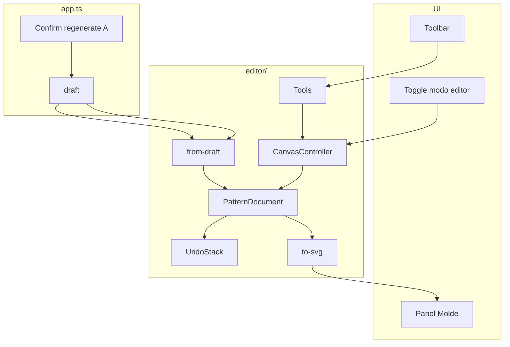

# Plano geral — Modo editor

## Objetivo

Permitir **edição fina** do molde após geração paramétrica: contorno por nós, toolbar, undo, e toggle para alternar entre preview estático (V1) e editor (V2).

## Arquitectura alvo



## Pastas novas (alvo)

```
editor/
  types.ts
  document.ts
  undo.ts
  adapters/
    from-draft.ts
    segments-to-path.ts
    path-to-segments.ts
  canvas/
    mount.ts
    viewport.ts
    hit-test.ts
    render.ts
  tools/
    select.ts
    move.ts
    add-node.ts
    delete-node.ts
    pan-zoom.ts
  export/
    to-svg.ts
```

Integração em `app.ts`: `editorEnabled`, `patternDocument`, `canvasController`; `render()` ramifica V1 vs V2.

## Comportamento do toggle

| Estado | Preview | Sliders |
|--------|---------|---------|
| Editor OFF | `renderDraftToSvg` → innerHTML (V1) | Regeneram sem aviso |
| Editor ON | Canvas interactivo | Se `hasManualEdits` → confirmar (A) |

Persistência sugerida: `localStorage` key `remodellista.editorMode` (opcional na TASK toggle).

## Critérios de done (MVP ondas 0–4)

- [ ] Toggle visível e funcional
- [ ] Com editor ON: seleccionar e mover nó em pelo menos uma peça (blusa frente)
- [ ] Undo/redo após mover nó
- [ ] Toolbar com ferramentas MVP activas
- [ ] Alterar slider com edição manual → diálogo confirmar/cancelar
- [ ] PDF exporta geometria editada (contorno; margem recalculada do contorno)
- [ ] `npm test` verde; cobertura `editor/**` ≥ 90% linhas

## Fora de escopo (MVP)

- Merge paramétrico por peça (opção B)
- DXF import
- Boolean entre peças
- Edição da linha de corte independente do contorno
