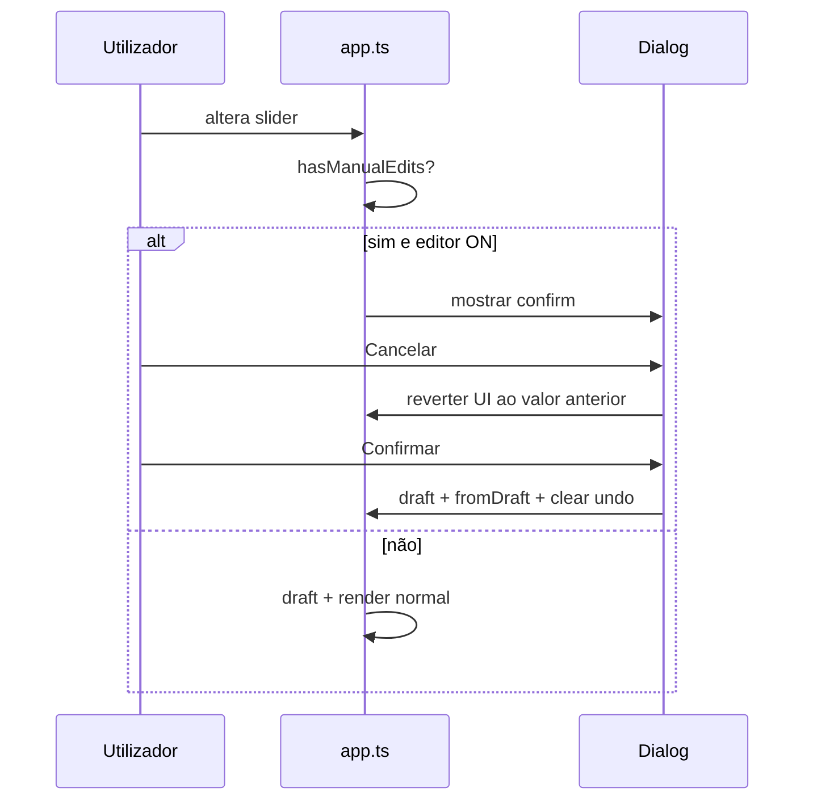

# TASK — Aviso de regeneração (opção A)

**Prioridade:** P0  
**Onda:** 3  
**Depende de:** [TASK-editor-document-model.md](TASK-editor-document-model.md), [TASK-editor-toggle-ui.md](TASK-editor-toggle-ui.md)  
**Bloqueia:** —

---

## Objetivo

Quando o utilizador altera **medidas, produto, composição ou preset** com modo editor ON e `hasManualEdits(doc)`, mostrar confirmação antes de chamar `draft()` — **opção A**: confirmar perde todas as edições manuais.

---

## Gatilhos

Interceptar antes de `render()` / `draft()`:

| Origem | Evento |
|--------|--------|
| Sliders de medidas | `input` / `change` |
| Select produto | `change` |
| Toggles composição | `change` |
| Presets composição | `click` |
| `seamAllowance` (se existir slider) | `change` |

Não interceptar: pan, zoom, undo, mover nó, toggle editor OFF.

---

## Fluxo

---

## UI do diálogo

- `<dialog id="editor-regenerate-dialog">` nativo ou overlay simples
- Título: **Regenerar molde?**
- Texto: As edições manuais no modo editor serão perdidas. O molde será calculado de novo com as medidas actuais.
- Botões: **Cancelar** (secondary), **Regenerar** (primary, destrutivo)

---

## Implementação (`app.ts`)

| Função | Papel |
|--------|-------|
| `pendingRegenerate(action)` | wrapper async |
| `revertControl(control, previousValue)` | restaura slider/select |
| `applyRegenerate()` | `draft()`, `fromDraft`, `undoStack.clear()`, `canvas.setDocument` |

Guardar `lastDraft` e valores de controles para revert.

---

## Modo editor OFF

- Sem diálogo; fluxo V1 actual.

---

## Ficheiros

| Ficheiro | Acção |
|----------|-------|
| `index.html` | `#editor-regenerate-dialog` |
| `styles.css` | `.editor-dialog` |
| `app.ts` | interceptação |
| `app.integration.test.ts` | editar nó → slider → cancelar mantém doc |

---

## Critérios de aceite

- [ ] Com edições manuais, cancelar não chama `draft()` e restaura valor do slider
- [ ] Confirmar substitui documento e zera `manualEditRevision`
- [ ] Sem edições manuais, slider regera sem diálogo
- [ ] Toggle editor OFF nunca mostra diálogo
