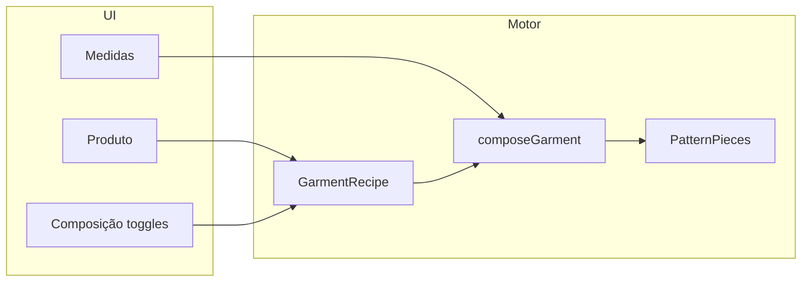
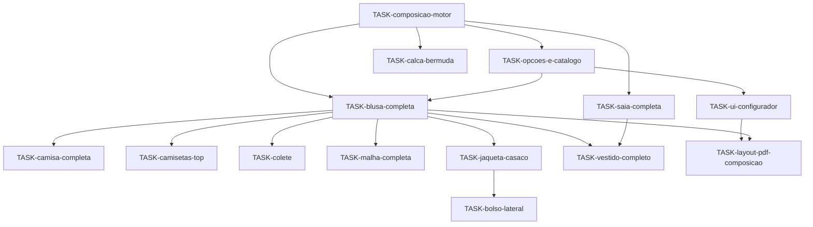

# Plano geral — Peças completas configuráveis

## Problema

O motor trata **produto** e **composição** como a mesma coisa:

- `blusa` → sempre 2 peças, sem manga nem aviamentos.
- `camisa` → sempre 8 peças, mesmo que o utilizador queira só corpo ou camiseta sem colarinho.
- `casaco` → corpo + manga, sem bolsos nem gola de jaqueta.
- Inferiores → sem cós/bolsos na UI (só flag interna em saia).

O utilizador pensa em **“blusa com manga longa e gola”** ou **“jaqueta com bolso lateral”**, não em IDs isolados (`manga`, `bolso-peito`).

## Objetivo

Introduzir **receitas de composição** por produto: slots de partes com `default`, `allowed`, `required`, ligados a `DraftOptions` e ao UI.

## Matriz produto × partes (alvo)

Legenda: **O** = obrigatório no preset · **·** = opcional · **—** = não aplicável

| Parte (`PatternPiece.id`) | blusa | camisa | camiseta/top | colete | malha | casaco/jaqueta | saia | calça | bermuda | vestido |
|---------------------------|:-----:|:------:|:------------:|:------:|:-----:|:--------------:|:----:|:-----:|:-------:|:-------:|
| `blouse-front` / `blouse-back` | O | O | O | O | O | O | — | — | — | O bodice |
| `sleeve` | · | O | · | — | · | O longa | — | — | — | · |
| `collar-stand` + `collar-fall` | · | O | — | — | — | · | — | — | — | · |
| `cuff` | · | O | — | — | — | · | — | — | — | · |
| `placket` | — | O | — | — | — | · | — | — | — | — |
| `chest-pocket` | · | O | · | · | — | · | — | — | — | — |
| `side-pocket` | — | — | — | — | — | · | — | · | · | — |
| `skirt-front` / `skirt-back` | — | — | — | — | — | — | O | — | — | O |
| `pant-front` / `pant-back` | — | — | — | — | — | — | — | O | O | — |
| `waistband` | — | — | — | — | — | — | · | · | · | — |

## Presets (atalhos UI)

| Preset | Produto base | Composição |
|--------|--------------|------------|
| Blusa básica | `blusa` | Corpo apenas |
| Blusa + manga longa | `blusa` | Corpo + manga (`sleeveLength` = medida) |
| Camisa clássica | `camisa` | Todos os slots camisa ON |
| Camiseta | `top-sem-mangas` ou `blusa` | Corpo + manga curta; sem colarinho; sem carcela |
| Colete | `colete` (novo) | Corpo; `sleeveless`; bolso peito opcional |
| Jaqueta | `casaco` | Corpo + ease; manga longa fixa; bolso lateral ON |
| Saia com cós | `saia-reta` | Saia + `waistband` |
| Calça completa | `calca` | Pernas + cós + bolsos opcionais |

## Ondas e dependências

| Onda | Entregável | Critério |
|------|------------|----------|
| 0 | Motor + catálogo + UI composição | `composeGarment('blusa', opts)` filtra partes |
| 1 | Superiores configuráveis | Presets camisa/camiseta/blusa testados |
| 2 | Casaco/jaqueta | Manga longa locked; bolso lateral |
| 3 | Inferiores | Cós e bolsos na UI |
| 4 | Vestido | Bodice + saia + opções bodice |
| + | PDF/layout | Só partes activas |

## Fora de escopo (documentar, não bloquear)

- Lapela de blazer (fase 2 em `TASK-jaqueta-casaco-completa.md`)
- Forro duplicado
- Margem de costura exportada no PDF
- Raglan / manga kimono
- Gola Peter Pan / militar (`TASK-parte-golas-variantes.md` fase 2)

## Ficheiros de código afectados (previstos)

| Área | Ficheiros |
|------|-----------|
| Modelo | `engine/composition/types.ts`, `recipes/*.ts`, `compose.ts` |
| Produtos | Refactor `products/*.ts` → chamam `composeGarment` |
| Catálogo | `catalog/products.ts` — `recipe`, `compositionFields` |
| UI | `app.ts`, `index.html` — secção composição |
| Render | `render/layout.ts`, `render/pdf.ts` — lista de ids activos |
| Testes | `engine/composition/*.test.ts`, integração por preset |
