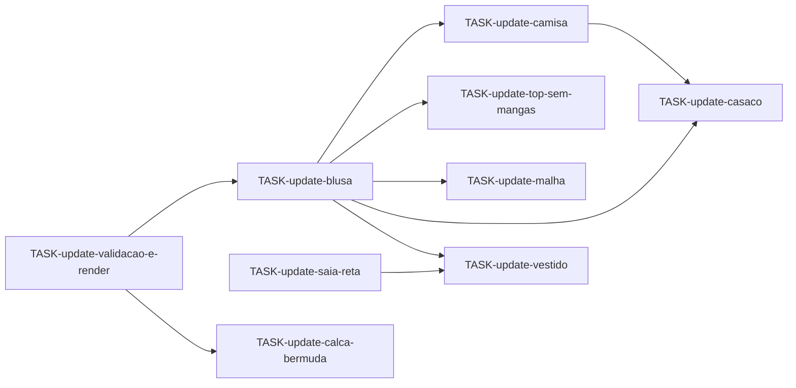

# Plano geral — Atualização de algoritmos

**Objetivo:** corrigir geometria e completar **produtos inteiros** no motor TypeScript, não peças isoladas no seletor principal.

**Pasta:** `manager/pecas/plan-update/`  
**Estado base:** implementação das ondas em `../plan/` concluída estruturalmente; qualidade visual e fórmulas **insuficientes**.

---

## Definição de produto completo (atualizada)

| Product ID | Peças mínimas no `DraftResult` | Medidas UI |
|------------|-------------------------------|------------|
| `blusa` | `blouse-front`, `blouse-back` | bust, height, waist, wrist, sleeveLength |
| `camisa` | frente, costas, manga, `collar-stand`, `collar-fall`, `cuff`, `placket`, `chest-pocket` | + as da blusa |
| `saia-reta` | `skirt-front`, `skirt-back` | waist, hip, hipDepth, skirtLength |
| `calca` | `pant-front`, `pant-back` | waist, hip, crotchDepth, inseam |
| `bermuda` | idem calça, `outseam` / comprimento derivado | + flag ou produto derivado |
| `vestido` | 4 peças bodice + saia | bodiceLength, skirtLength, hip, … |
| `top-sem-mangas` | frente + costas (`sleeveless`) | bust, height, waist |
| `casaco` | frente, costas, manga (ease) | designEaseBust, coatLength, … |
| `malha` | frente + costas (perfil knit) | bust, height, waist |

**Fora do escopo desta onda:** produtos só `punho`, `colarinho`, `cos` no seletor (mantêm-se para debug; não são “produto completo” de vestuário).

---

## Ondas de atualização

### Onda A — Corpo superior (P0)

1. [TASK-update-blusa.md](TASK-update-blusa.md) — baseline de todas as camisas  
2. [TASK-update-validacao-e-render.md](TASK-update-validacao-e-render.md) — em paralelo parcial  
3. [TASK-update-camisa.md](TASK-update-camisa.md) — depende de blusa + validação manga  

### Onda B — Inferiores (P1)

4. [TASK-update-saia-reta.md](TASK-update-saia-reta.md)  
5. [TASK-update-calca-bermuda.md](TASK-update-calca-bermuda.md)  

### Onda C — Compostos (P1)

6. [TASK-update-vestido.md](TASK-update-vestido.md) — depende blusa + saia corrigidas  
7. [TASK-update-top-sem-mangas.md](TASK-update-top-sem-mangas.md)  
8. [TASK-update-malha.md](TASK-update-malha.md)  

### Onda D — Exteriores (P2)

9. [TASK-update-casaco.md](TASK-update-casaco.md) — depende blusa + manga corrigidas  

---

## Constantes de ease (configuráveis)

Extrair para `engine/constants.ts` ou `engine/ease.ts`:

| Constante | Valor alvo (cm) | Uso |
|-----------|-----------------|-----|
| `EASE_BUST_BLOCK` | 5 | Aldrich bloco justo |
| `EASE_WAIST_BLOCK` | 3 | Cintura bloco |
| `CAP_EASE_TARGET` | 3,2 – 4,4 | Cabeça manga vs perímetro cava |
| `CROTCH_DEPTH_FALLBACK` | `0,175×W + 15,4` | Calça se `crotchDepth` ausente |

---

## Critérios de done global

- [ ] Cada produto P0/P1 passa golden test com tolerância ≤ 2 px em pontos-chave  
- [ ] SVG: contorno contínuo, sem auto-interseção; tracejado = construção  
- [ ] `render/layout.ts` dispõe todas as peças do produto sem sobreposição  
- [ ] Guardrails reportam instabilidade antes de SVG inválido  
- [ ] Fichas `manager/pecas/*.md` coluna Remodellista = “Validado”  

---

## Dependências entre tasks

